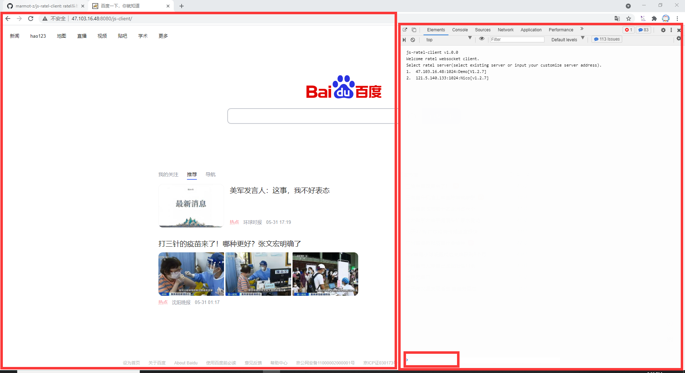
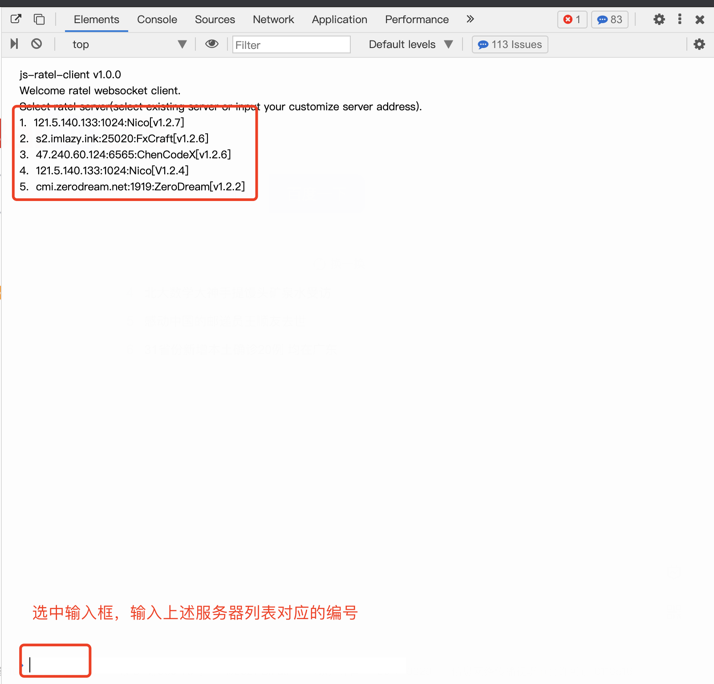
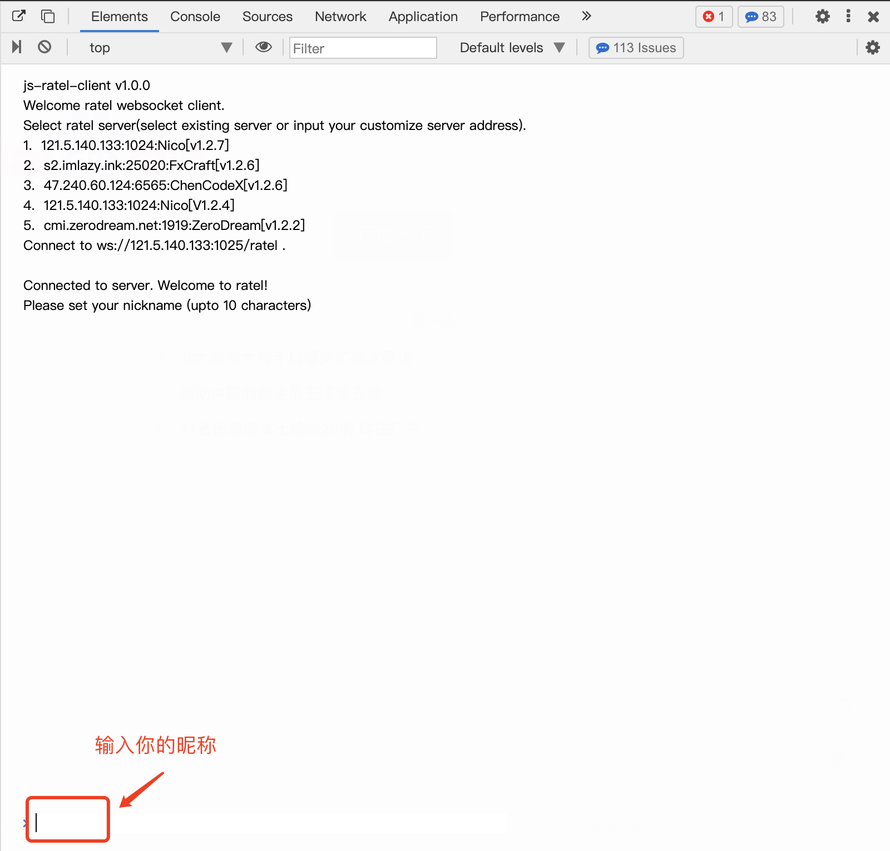
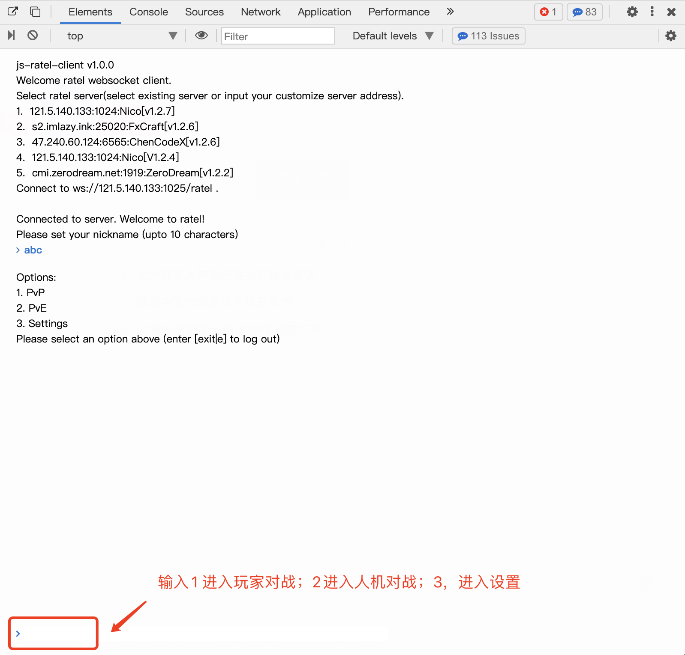
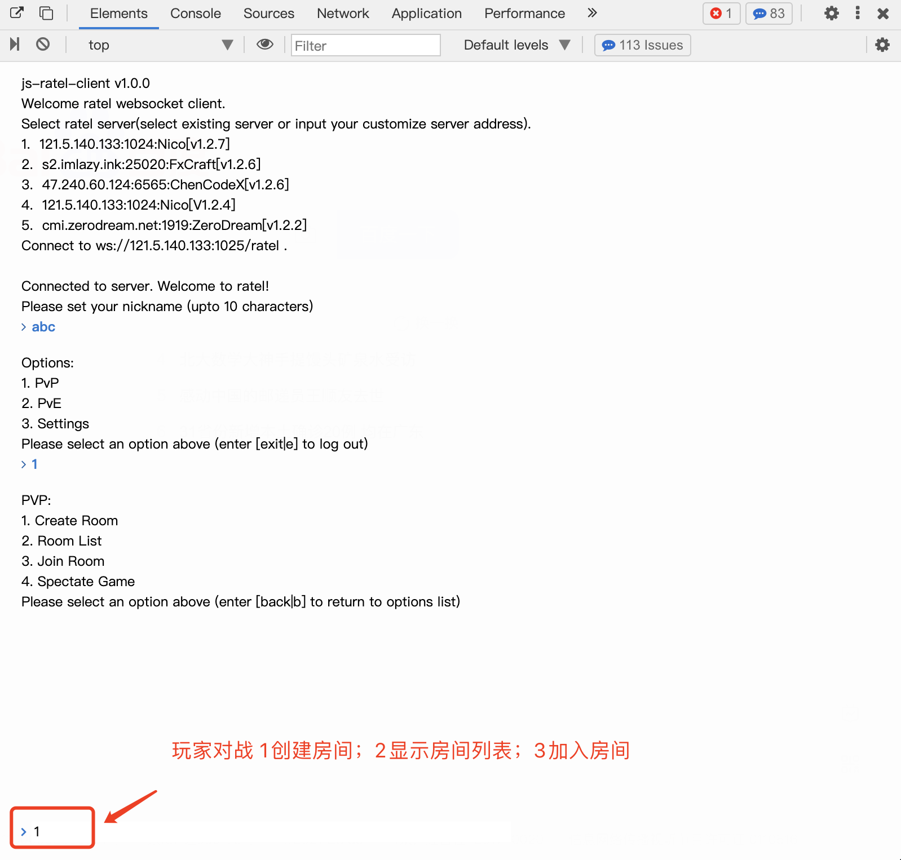
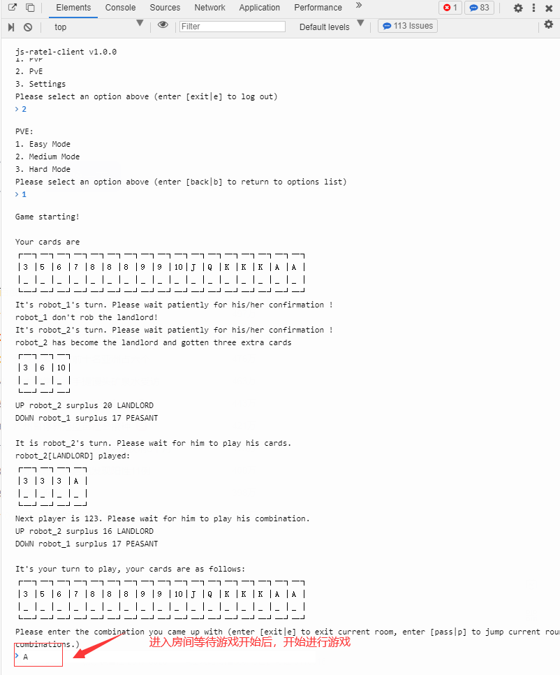

## 如何使用js-client进行游戏

打开页面后，布局如下图所示：

左侧是百度或者其它页面，右侧是游戏界面（该界面是模拟`chrome`控制台样式的`div`，真正的`chrome console`使用<kbd>F12</kbd>或其它快捷键打开），游戏输入在右侧游戏界面的下方。

大概游戏步骤如下：

1. 选择需要连接的游戏服务器（版本需要大于**1.2.7**）。你可以选择界面上展示的服务器地址（输入对应的服务器编号），也可以输入你自己的服务器地址，格式为`ip:port`（如：127.0.0.1:8080）

   

2. 连接成功后，会提示连接成功（如果连接失败可以选择另一个符合条件的服务器进行连接），需要输入自己的昵称进行游戏

   

3. 输入对应的选项（即选项前对应的数字）进行对应的功能（如模式选择中1是玩家对战；2是人机对战；3是进入设置。玩家对战功能中1是创建房间；2是显示房间列表；3是加入房间。）

   

   

4. 加入房间后等待玩家到齐，开始游戏

   

具体游戏中的出牌规则请参考[ratel](https://github.com/ainilili/ratel)

